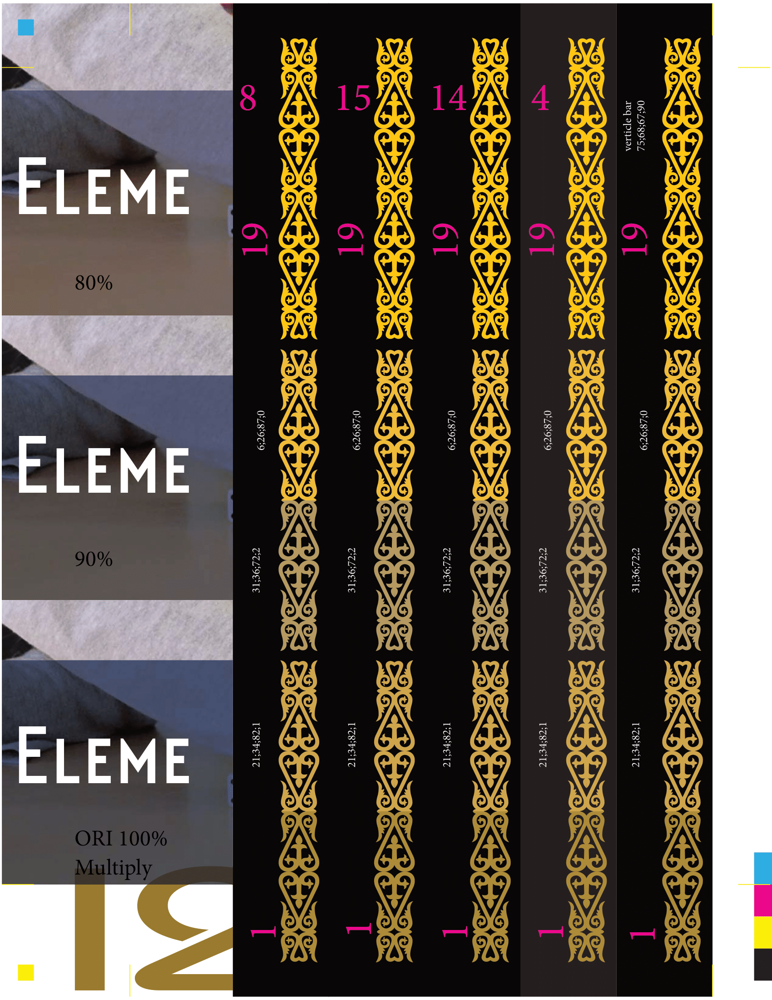
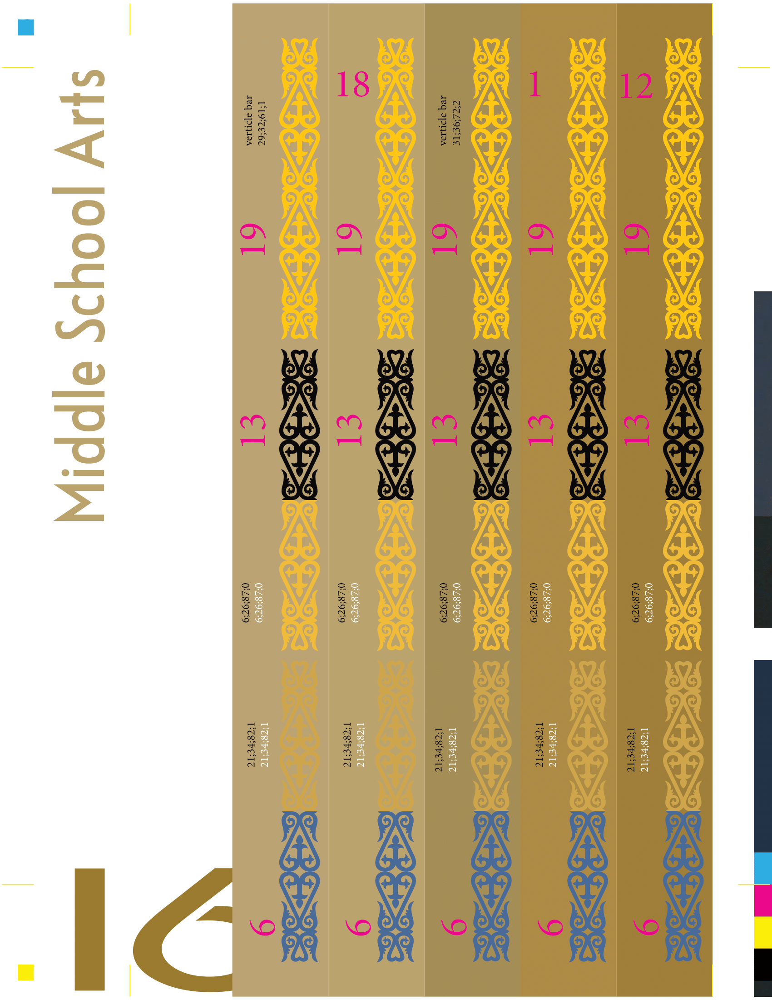

# Yearbook

Yearbook is a type of book published annually. It is to record, highlight, and commemorate the past year of school. Many high schools, colleges, elementary and middle schools have yearbook.

I was a head designer of yearbook in Almaty International School in Kazakhstan from 2016 to 2018.

There I had a designer team of 6 ~ 8 new people. The goal of us is to created the designs and actually develope the design to be real thing using Adobe Indesign.

This is the sample we made to check in real life whether our CMYK colors, opacities, and colour mixes are appropriate.

## Challendge

The biggest challenge we faced was to actually get used to the software. There were many folks who did not have basic understanding of computer. (Some of us did not know what is Ctrl C and Ctrl V) Throughout the fall semester we went through series of tutorials and workshop made by me to practise our skills. Throughout the winter semester, based on desgin frame we have established we worked on actually designing the book.

## What have we learned

We have learned the power of Adobe. It has great tools like Photoshop, Indesign, Illustrator and After Effect. All of the mentioned software has been used during the production. At that time, we were not aware what we were doing but we were developing yearbook using agile model. Communication between team members and other departures was very important to erase misunderstandings and save a lot of time and money.